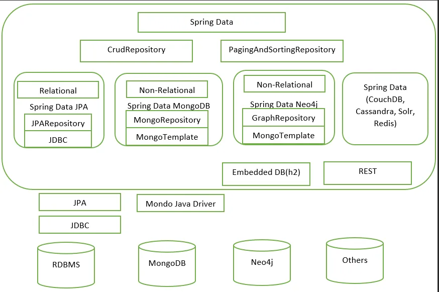

# Spring Data

**еще раз о JDBC и JPA**

JDBC – это мост между миром Java и миром баз данных. Ведь первое, что мы ищем когда хотим подключить базу данных к нашему приложению – jdbc драйвер. Если мы работаем с Maven, тогда мы ищем зависимость для драйвера к определенной базе.

Спецификация Java Persistence API – это технология, которая позволяет удобно мапить объект Java и таблицу базы данных. 

В JDBC при написании каждого запроса, Вам необходимо указать в коде все детали, необходимые для операций CRUD, такие как имена таблиц, имена столбцов. В JPA (которая использует JDBC “под капотом”) Вы также указываете эти данные, но уже только один раз, когда навешиваете аннотации на Java класс:

Spring Data JPA – это библиотека, которая добавляет дополнительный уровень абстракции поверх ORM реализации JPA. По умолчанию Spring Data JPA использует Hibernate, в качестве ORM провайдера (чтобы выполнять запросы). 

CrudRepositoryпредоставляет функции CRUD

PagingAndSortingRepositoryпредоставляет методы для разбиения на страницы и сортировки записей

JpaRepositoryпредоставляет методы, связанные с JPA, такие как очистка контекста сохраняемости и удаление записей в пакете

